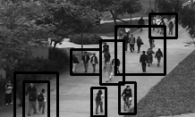

# Anomaly_Detection
In this project we are going to detect anomalies. Footage or data that we are using will be of stationary camera mounted at pedestrian walkways.The crowd density in the walkways was variable, ranging from sparse to very crowded. Abnormal crowd event can be classified into two groups on the basis of a scale of interest: global anomalous event and local anomalous event. The global anomalous event (GAE) concentrates on deciding if the whole scene is abnormal or not, whereas the local anomalous event (LAE) determines the regions where the abnormal event is happening within the scene.

In this project we are trying to detect LAE from the video.

## Evaluation
The evaluation is done by F1 Score.

## Approaches 
We followed two different approaches to detect the LAE from the scene and finally used random forest to detect anomaly.In first trial to detect human we used SSD, background subsration and optical flow. We generated different images from it to train on CNN. but we later found that data generated not capturing the important features like speed.

 
 <b> Tracking Using SSD </b>

   

  

so finally we generated features and there labels using background substration and optical flow and train model using random forest. Using optical flow we generated different features like angle and magnitude of Vx and Vy.  

<b>Tracking Using Background substraction</b>
   

  
  
  <b> Tracking Using Optical Flow </b>
   

  

so by using above methods we have tracked pedestrians. After that we generated data using optical flow like vx, vy and direction. As we have train data , we have used decision trees to classify local area into two classes normal and abnormal.
At the end of this file you can see classified local area in white boxes.  
## Dataset
We have used [UCSD Anomaly Detection Dataset](http://www.svcl.ucsd.edu/projects/anomaly/UCSD_Anomaly_Dataset.tar.gz) in this project. It consists of dataset which was split into 2 subsets, each corresponding to a different scene. The video footage recorded from each scene was split into various clips of around 200 frames.

Peds1: clips of groups of people walking towards and away from the camera, and some amount of perspective distortion. Contains 34 training video samples and 36 testing video samples. 

Peds2: scenes with pedestrian movement parallel to the camera plane. Contains 16 training video samples and 12 testing video samples.

## Dependencies

	python3.6
	cv2
	scikit-learn
	pandas
	numpy

## Running Instruction

### Detect the anaomaly from scene
	
	python3 video_classifier.py 
	
## Results

We have achieved F1 score of 0.2251 on USCD anomaly dataset
Result -  

 
	
Test Event -

  

Result -  

 

## References

- [Deep-anomaly: Fully convolutional neural network for fast anomaly detection in crowded scenes](https://arxiv.org/abs/1609.00866)
- [Anomaly detection in crowded scenes](https://ieeexplore.ieee.org/document/5539872)
* For the purpose of this experiment we have refered this Github repository[https://github.com/abendayan/anomaly-detection/blob/master/foreground_objects_features]
 

